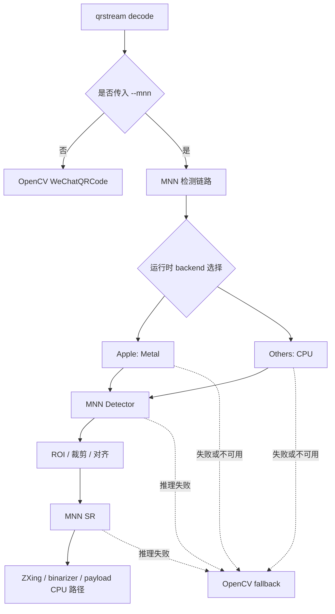

# WeChatQRCode -> MNN PoC

> 🗄️ **ARCHIVED (2026-04-26)** — 本分支已冻结，**不会合入 `dev`**。
>
> 最终结论：端到端加速 ≈ 1.05×（远低于立项预期的 2–7×），根因见
> [`results/m3_final_report.md`](results/m3_final_report.md)。`--mnn` 仍保留为 opt-in 开关，
> 默认路径保持 `OpenCV WeChatQRCode`。
>
> **先读 [`results/m3_final_report.md`](results/m3_final_report.md)**（收官总结 + 重启 PoC 的触发条件）。
> 本 README 后续内容保留原始研究/设计记录，供未来重启参考，**不代表当前推荐做法**。

---

### 目标

在**尽量少引入外部依赖**的前提下，把 `WeChatQRCode` 的两个 Caffe CNN（检测 + 超分）迁移到 `MNN` 推理栈，优先降低单帧检测延迟，并保留当前仓库的解码与 LT 流程。

第一版不追求全平台 GPU 覆盖，而是先把 **Apple `Metal -> CPU`** 路线做透，同时保留 `OpenCV WeChatQRCode` 作为稳定 fallback。

### 当前结论

- 上游 `wechat_qrcode` 源码已拉取到 `dev/wechatqrcode-mnn-poc/third_party/opencv_contrib/modules/wechat_qrcode`
- 这部分上游源码仅作为本地参考与对照，不纳入本仓库版本提交
- 当前工作分支：`feature/wechatqrcode-research`
- 当前仓库已改用 `feature/* -> dev -> main` 的提交流程；本 PoC 后续按 `feature/*` 工作分支推进
- `WeChatQRCode` 的两个 CNN 都是通过 `OpenCV DNN + Caffe` 加载：
  - `src/detector/ssd_detector.cpp` -> `dnn::readNetFromCaffe(...)`
  - `src/scale/super_scale.cpp` -> `dnn::readNetFromCaffe(...)`
- **M0 完成**：两个 Caffe 模型已转成 `.mnn`，输出与 OpenCV DNN 对齐；Apple M4 Pro 上 MNN Metal **detector 单次推理**比 WeChatQRCode 全套快 7~126 倍（详见 `results/m0_report.md`；注意这是 detect-only 比值，不是 end-to-end）
- **M1 完成**：`DetectorRouter` 已真正接入 `ThreadPoolExecutor` worker，`--mnn` 显式开关生效；Linux + MNN CPU 端到端 decode 通过（详见 `results/m1_report.md`）
- **M1.5 完成**：修复 `MNNQrDetector` tight-crop 丢 quiet-zone 导致的 0% 解码命中，端到端 MNN CPU –21% / MNN Metal –45%；`DetectorRouter` 加自适应 `opencv_fallback`；MNN 路径下跳过 sandbox（详见 `results/quiet_zone_fix_report.md`、`results/adaptive_fallback_report.md`）
- **M1.75b 完成**：`_cpu_decode` 完全切换到 `zxing-cpp` 多路二值化策略（4 次尝试：`LocalAverage` → `GlobalHistogram` → `cv2.adaptiveThreshold` 预处理 → 反色重试），彻底移除 MNN 路径对 `WeChatQRCode` 的依赖。调研数据：zxing-cpp 多路命中率 87.3%（vs WeChatQR 87.5%，差距 0.2% / 9 帧 / 755），avg decode 17 ms（vs WeChatQR 33 ms → **1.9× 加速**），`overhead=1.5` 不受影响。`zxing-cpp` 升级为核心依赖（`pyproject.toml` `dependencies`）。`Containerfile.m175` 全量回归 282 fast + 4 slow 全绿。
- 第一条 PoC 主线 `Caffe -> MNN` 已完整验证，后续进入 M2（打包）→ M3（profile-driven 端到端优化，详见下方决策日志）
- **M2 完成**：CPU 正式版打包落地。模型文件从 `dev/` 迁移到 `src/qrstream/detector/models/` 作为 package data 分发，支持 `QRSTREAM_MNN_MODEL_DIR` 环境变量覆盖，自动 fallback 到 dev 路径。`QRDetector` 基类新增 `detect_batch` 默认实现（M3 预留抽象），`DetectorRouter` 透传。改善 MNN 不可用 / 模型缺失时的用户友好错误提示。`Containerfile.m2` 全量回归 291 fast + 4 slow 全绿。

#### Milestone 顺序调整（2026-04-26，两轮）

**第一轮调整**（按价值/成本重排）：原顺序 `M3 CUDA/OpenCL → M4 [all] → M5 Batch → M6 流式` 调整为：

| 新 | 原 | 内容 | 状态 |
|---|---|---|---|
| M3 | M5 | ~~Batch 加速~~ → profile-driven 端到端优化（详见 3.1a 决策日志） | 🚧 规划中 |
| M4 | M6 | 流式输入输出 | ⏳ |
| M5 | M3 | CUDA / OpenCL 扩展 | ⏳ |
| M6 | M4 | `qrstream[all]` + auto 策略 | ⏳ |

**第二轮调整**（M3 内容换 scope，同日）：原计划的"MNN batch 加速"被 probe 数据否决：

1. MNN 3.5 `DetectionOutput` 算子在 batch > 1 时丢失所有检测（`probe_mnn_batch_output_v2.py`）
2. 绕开 DetectionOutput 的 raw-tensor 方案在 CPU 上 batch=16 也只有 1.43× per-frame 加速（`probe_mnn_batch_raw_perf.py`）
3. CNN 推理只占端到端 ~4.5%（Amdahl 上限 1.5%），连不到 M3 原定的 2× 吞吐

M3 因此改为 **profile-driven 端到端优化**，新目标 ≥ 1.5× 端到端吞吐。详见 §3.1a。

#### 未来改进：C++ Finder Pattern 增强

当前 zxing-cpp 多路策略与 WeChatQR 的 0.2% 识别率差距（9/755 帧）来自微信团队的 C++ 级 Finder Pattern 增强，这些无法通过 Python 预处理层复刻：

1. **连通域辅助检测 (UnicomBlock BFS)**：在二值化图上做 4-邻域 BFS 连通域分析，用面积比（`sqrt(外黑圈/24)` ≈ `sqrt(白圈/16)` ≈ `sqrt(中心点/9)`）验证候选 Finder Pattern，比纯 1D 行扫描对倾斜/遮挡更鲁棒。
2. **Spill State 容错匹配**：标准 ZXing 严格要求 1:1:3:1:1 比例，微信允许边界溢出（`n:1:3:1:1` / `1:1:3:1:n`），当 Finder Pattern 外黑边与图像边缘合并时仍能检测。
3. **多偏移交叉验证**：在中心点 ±1/2/3 倍 tolerateModuleSize 处各做一次 vertical + horizontal cross-check（共 7 个候选位置取前 3），提高对畸变 QR 的容忍度。
4. **K-Means 聚类选组**：候选 Finder Pattern 超过 10 个时，用 `(count, moduleSize)` 特征做 K-Means 分簇后在簇内穷举三元组，配合等腰直角三角形余弦定理验证。

**如果未来需要弥合这 0.2% 差距**，推荐路径：
- 方案 A：向 zxing-cpp 上游提 PR，把微信的连通域检测移植到 zxing-cpp 的 `FinderPatternFinder`（C++ 层面，社区受益）
- 方案 B：在 Python 层用 `cv2.connectedComponentsWithStats()` 做二次候选过滤（性能代价 ~2ms/crop，精度收益有限）
- 方案 C：等 zxing-cpp 自身迭代——其 Finder Pattern 检测逻辑一直在改进中（v3.0 相比 v2.x 已有明显提升）

### 为什么优先选 MNN

- **支持直接 `Caffe -> MNN`**，不一定必须先转 ONNX
- backend 覆盖面贴近目标需求：`CPU / Metal / CUDA / OpenCL`
- 适合做“小核心 + 按后端裁剪”的轻量分发
- Python 层显式依赖较少，便于与当前 `qrstream` 集成
- 对 Apple 首版非常友好：`Metal` 是系统原生能力，宿主依赖最少

### 产品方向先拍板

这次讨论后，后续方案统一按下面的产品化约束推进：

- **默认安装包**：`qrstream`
  - Apple 平台：默认尝试 `Metal -> CPU`
  - 其他平台：默认 `CPU`
- **额外版本 / extras 语义**：
  - `qrstream[cpu]`：显式 CPU 版，运行时 `CPU`
  - `qrstream[cuda]`：启用 `CUDA -> CPU`
  - `qrstream[opencl]`：启用 `OpenCL -> CPU`
  - `qrstream[all]`：启用所有支持的后端，运行时统一 fallback 到 `CPU`
- **第一版行为**：
  - 保留 `OpenCV WeChatQRCode` 作为 fallback
  - 新增 `--mnn` 参数，显式开启 MNN 加速路径
  - 第一版只实现 `Metal` 版本
  - 非 Apple 平台第一版不做 GPU 加速落地，先走 `CPU / OpenCV fallback`

### 对外安装与运行策略

#### 1. 安装层策略

目标不是让 `pip` 在安装时猜 GPU 厂商，而是：

- 让 `pip` 只负责**按平台挑 wheel**
- 让 `qrstream` 在**运行时选择 backend 并 fallback**

建议对用户暴露为：

```bash
pip install qrstream
pip install 'qrstream[cpu]'
pip install 'qrstream[cuda]'
pip install 'qrstream[opencl]'
pip install 'qrstream[all]'
```

实现上建议：

- 默认 `qrstream` 发布为**平台感知 wheel**
  - macOS wheel：编入 `Metal`
  - 非 macOS wheel：默认只保留 `CPU`
- `cuda/opencl/all` 对外暴露为 extras 语义
- extras 的内部落地可选：
  - 后端子包
  - 平台专属 wheel
  - 单独 backend runtime 包

也就是说，**对用户是 extras 语义，对维护侧不强制必须是单一 wheel**。

#### 2. 运行时策略

第一版约束如下：

- 默认不启用 MNN，仍走当前 `OpenCV WeChatQRCode`
- 用户显式加 `--mnn` 时才进入新路径
- 第一版 backend 选择规则：
  - Apple：`Metal -> CPU -> OpenCV fallback`
  - 其他平台：`CPU -> OpenCV fallback`
- 后续版本扩展为：
  - `CUDA -> CPU -> OpenCV fallback`
  - `OpenCL -> CPU -> OpenCV fallback`
  - `All(auto) -> 最优可用 backend -> CPU -> OpenCV fallback`

### 第一版推荐接口

#### CLI

第一版先保持接口最小增量：

```bash
qrstream decode input.mp4 -o output.bin
qrstream decode input.mp4 -o output.bin --mnn
```

建议解释为：

- 不带 `--mnn`：沿用现有 `OpenCV WeChatQRCode`
- 带 `--mnn`：尝试启用 MNN 加速链路
- 如果 MNN backend 不可用或推理失败：自动回退到 `OpenCV WeChatQRCode`

#### Python API

建议新增一个显式开关，而不是立即重写所有默认路径：

- `use_mnn: bool = False`
- 后续再扩展可选 backend 枚举，例如：`auto/cpu/metal/cuda/opencl`

第一版不建议暴露太多 backend 参数，先把 `--mnn` 的正确性和 fallback 逻辑跑稳。

### 首版架构图



### 分阶段实施边界

#### Milestone 0：研究与模型验证

目标：证明两个模型**能转**、**能跑**、**输出结构基本对齐**。

- 提取并归档模型文件来源与哈希
- 使用 `MNNConvert` 尝试：
  - `detect.caffemodel + detect.prototxt -> detect.mnn`
  - `sr.caffemodel + sr.prototxt -> sr.mnn`
- 用少量静态图片验证：
  - detector 是否输出合理 bbox
  - SR 是否输出正确尺寸与像素范围
- 暂不接业务主链，只做离线比对

#### Milestone 1：Apple Metal 首版接入 ✅ 已完成

目标：在 **Apple 平台** 打通 `Metal -> CPU -> OpenCV fallback`，并提供 `--mnn` 显式开关。

交付物：

- ✅ `MNN Detector Runner` + `MNN SR Runner`（`src/qrstream/detector/mnn_detector.py`，per-thread MNN session）
- ✅ MNN 可用性检测与 backend 选择层（`src/qrstream/detector/mnn_backend.py`）
- ✅ `decode` 路径 `--mnn` 开关（CLI + `extract_qr_from_video(use_mnn=True)`）
- ✅ 可替换 `QRDetector` 适配层（`src/qrstream/detector/base.py`、`opencv_wechat.py`、`router.py`）
- ✅ **`DetectorRouter` 真正接入 `ThreadPoolExecutor` worker**（通过 `functools.partial`），覆盖 probe、main scan、targeted recovery 三条 worker 路径
- ✅ 与 `origin/fix/wechat-native-crash` 的兼容基线保持一致：`DETECTOR_CAN_CRASH` 标志、`active_detector_can_crash` 暴露给未来 `--detect-isolation` 使用
- ✅ 保留 `OpenCV WeChatQRCode` 作为 fallback，默认行为不变
- ✅ MNN 初始化失败 / 推理失败 / 输出异常时自动回退到 OpenCV
- ✅ `verbose` 模式下打印 `DetectorRouter` 统计（`mnn_success/attempts, opencv_success/attempts`）
- ✅ malformed frame / 空 ROI / 异常 bbox / 异常 tensor shape 的单元回归测试（`tests/test_detector.py`、`tests/test_detector_integration.py`）
- ✅ `dev/wechatqrcode-mnn-poc/Containerfile.m1` 提供 podman 验收容器（Linux + MNN CPU，含全量回归），M0 的 Metal 性能基线沿用 `results/m0_report.md`
- ✅ 所有回归与集成测试通过：**163 fast + 4 slow（MNN CPU 端到端）**

详见 `results/m1_report.md`。

#### Milestone 1.5：命中率与 fallback 成本修复（已完成）

目标：end-to-end 测得 `--mnn` 比 `OpenCV` 慢的现象必须收敛到"M1 达成其合同范围内"的水平，再判断下一步是否需要进一步优化。

实际发现与落地（见 `results/quiet_zone_fix_report.md` + `results/adaptive_fallback_report.md`）：

1. **tight-crop 丢 quiet zone**（`fix(mnn): pad bbox by quiet-zone margin`）
   - MNN SSD 给出的 bbox 紧贴外部 finder，直接 `frame[y0:y1, x0:x1]` 交给 ZXing 会切掉 ISO/IEC 18004 要求的 4 模块静默区。
   - IMG_9425 抽样：`pad=0% → 0/100`，`pad=5% → 93/100`，`pad≥15% → 95/100` = OpenCV 全帧上限。
   - 修复：`_QUIET_ZONE_PAD_RATIO = 0.15`，在 `_clamp_bbox` 之后、裁剪之前按 bbox 短边扩展并 re-clamp；失败时 tight-crop 兜底重试。
   - 跨样本验证：`IMG_9425 / v061 / v070 / v073-10kB / v073-100kB / v073-300kB` 共 6 个真实样本，production 路径 6/6 追平或微超 OpenCV 全帧命中率。

2. **自适应 `opencv_fallback`**（`feat(router): adaptive opencv_fallback`）
   - padding 修完后 MNN 的 miss 绝大多数是 OpenCV 也救不回的脏帧，默认 fallback 每次都跑一次 OpenCV 纯浪费。
   - `DetectorRouter` 增加滚动窗口 rescue 率监控：`warmup=64 / window=256 / disable=2% / enable=5%` 双阈值滞回，`probe_interval=64` 保证压制期仍能感知 rate 恢复。
   - IMG_9425 上 MNN miss 中的 OpenCV 调用次数从 779 次压到 52 次（~15× 减少）。
   - 7 条单元回归锁定 disable / re-enable / probe / 滞回 / warmup / opt-out / status。

3. **MNN 路径跳过 sandbox**
   - `detect_isolation="on"` 仅在 `qr_router is None` 时启 `SandboxedDetector`。
   - MNN 路径由 `MNNQrDetector` 自己做边界安全，router 里的 OpenCV fallback 是进程内调用，sandbox 帮不到它，反而在某些 macOS 环境下 `import cv2` 阶段假 crash 3 个 helper。

IMG_9425.MOV 端到端（SHA256 匹配源文件）：

| 路径 | 修复前 | M1.5 落地后 |
|---|---:|---:|
| OpenCV 全帧 | 23.41 s | 25.65 s |
| MNN CPU | 30.05 s | **23.67 s** (–21.2%) |
| MNN Metal | 48.31 s | **26.34 s** (–45.5%) |

#### Milestone 1.75：替换 `MNNQrDetector._cpu_decode` 的 ZXing 路径 ✅ 已完成

##### 背景 — 为什么 end-to-end 远不如 M0 单帧数字亮眼

M0 报告里 `WeChatQR 49 ms → MNN Metal 1.3 ms → batch=16 0.39 ms → 126×` 是**纯 CNN detector 单次推理**的加速比。IMG_9425 上拆 M1.5 后的数据（`results-host/detect_breakdown_after_padding.json`）：

| 阶段 | avg ms/frame |
|---|---:|
| MNN CPU detect-only（CNN 推理） | **2.9 ms** |
| OpenCV 全帧 WeChatQRCode.detectAndDecode | 91.7 ms |
| **MNN production（detect + crop + pad + `_cpu_decode`）** | **74.0 ms** |

`_cpu_decode` 当前实现是：

```python
detector = cv2.wechat_qrcode_WeChatQRCode()
results, _ = detector.detectAndDecode(region)
```

MNN 已经给出 bbox 之后，我们在 cropped region 上**又整套跑了一遍 OpenCV 的 WeChatQRCode**——包括它自己的 SSD detect + SR + ZXing decode。于是：

- 每帧 74 ms 里 CNN 推理只占 2.9 ms（≈ 4%）。
- 其余 71 ms 是在 MNN 已选好的 crop 上**再跑一次完整 OpenCV pipeline**。
- Amdahl 定律：把 4% 的环节加速 38× 整体只能省 ~3.9% → 和实测的 MNN CPU "1.08× OpenCV" 完全对得上。
- Metal `DetectionOutput` 层不支持 GPU 会回落 CPU，加上 per-frame session 的 `copyFrom/copyToHostTensor` IO 没被摊薄（要靠 M3 的 batch），所以 Metal 在 end-to-end 反而略慢于 MNN CPU。

**结论：在 `_cpu_decode` 被替换之前，继续做 M3 batch 或扩展 GPU backend 都会被 `cpu_decode` 的 71 ms 吃掉，重复犯 M1 的认知错误。**

##### 目标

把 `_cpu_decode` 从 "整套 OpenCV WeChatQRCode" 替换为"只做 QR 解码"的轻量路径。MNN 已经提供了精确 bbox + padded crop，根本不需要再跑一次 detector/SR。

##### 调研方案（执行前先验证，不要直接替换）

候选解码器，按"信心"由高到低：

1. **`opencv.QRCodeDetector` / `cv2.QRCodeDetector`（原生 OpenCV，非 contrib）**
   - 轻量，不带 ZXing 的 wild-memory-access bug（`opencv_contrib#3570` 只出现在 `wechat_qrcode_WeChatQRCode`）。
   - 只能解 QR（不是 Data Matrix / PDF417）—— 对我们正好够用。
   - 已随 `opencv-contrib-python` 一起分发，零新依赖，零 wheel 风险。
   - 未知：对于 WeChat 系列 detector 能解、OpenCV 原生 detector 解不出来的"边缘质量"帧占比多少 —— 需要实测。

2. **`zxing-cpp`（纯 C++ ZXing C++ port，带 Python binding）**
   - Apache-2.0，维护活跃（2025 年仍有 release），比 OpenCV 里的 ZXing 新很多。
   - 对 QR 的识别率据多方 benchmark 高于 OpenCV 原生 QRCodeDetector；API 直接输入 grayscale ndarray。
   - 引入一个 C++ wheel 依赖，需要分别验证 linux-x86_64 / linux-aarch64 / macos-arm64 / macos-x86_64 的可用性。
   - 同样无 `wechat_qrcode_WeChatQRCode` 的 native-crash 问题。

3. **`pyzbar`（`libzbar-0` 的 Python wrapper）**
   - 老牌、稳定，支持多种 barcode 而不只 QR。
   - 需要系统级 `libzbar-0`（`brew install zbar` / `apt install libzbar0`），分发比前两者复杂。
   - 识别率在 low-quality 帧上一般不如 ZXing。

4. **手写 Finder Pattern locator + reed-solomon decoder**
   - 纯 Python / Cython；依赖最少，但开发成本高，不作为首选。

##### 调研验收项

新建 `dev/wechatqrcode-mnn-poc/scripts/probe_cpu_decoders.py`：

- 输入：`IMG_9425.MOV` + 5 个 `tests/fixtures/real-phone-v[34]/*.mp4`。
- 对每个样本抽样 200 帧，用 MNN CPU 先拿 padded crop（复用 M1.5 后的 padding 逻辑）。
- 每个候选解码器分别跑 200 个 crop，记录：
  - 识别率（`hit_rate`）、avg_ms、p95_ms。
  - **重要**：记录 "仅 OpenCV WeChatQRCode 能解、候选不能解" 的帧集合（判断候选对边缘帧的鲁棒性）。
- 输出：`results/cpu_decoder_survey.md`，给出首选 + 备选的组合策略。

##### 落地方案（候选确定后）

约束：

- **不破坏 `_cpu_decode` 当前错误兜底的 API 契约**——失败时返回 `None`，由 `MNNQrDetector.detect` 的 padded → tight 重试路径继续保底。
- **保留 OpenCV WeChatQRCode 作为二级 fallback**：候选解码器 miss 时再调一次 WeChatQRCode（概率很低但补齐识别率长尾）。这条回退只在 M1.5 的自适应控制器之外发生，不进 `DetectorRouter` 统计，由 `_cpu_decode` 内部自包含。
- **继续走 `DetectorRouter.opencv_fallback` 机制**：crop 级二级 fallback 失败后，router 层的帧级 OpenCV fallback（自适应控制）仍有机会再救一次。

##### 5.4 量化验收项

- `MNNQrDetector.detect` 单帧 avg P50 ≤ 15 ms（目前 74 ms；预期 ≈ CNN 2.9 ms + crop/SR 2–3 ms + 新 decoder 5–10 ms）。
- IMG_9425 end-to-end：MNN CPU ≤ 12 s、MNN Metal ≤ 10 s（目前 23.67 / 26.34 s，预期 2–3× 进一步提速）。
- 6 个跨样本 `production` 命中率不低于 M1.5 的测量值（保证不为速度牺牲识别率）。
- 所有 fast 回归继续全绿；新增 `test_cpu_decode_contract.py` 覆盖 "candidate 失败 → WeChatQRCode 保底 → None" 的决策树。

##### 与 M3 的顺序锁定（原 M5）

**M1.75 必须先于 M3 完成。** 否则 M3 把 CNN 推理从 2.9 ms 压到 0.4 ms，每帧也只能省 2.5 ms（仍被 71 ms 的 `_cpu_decode` 主导），end-to-end 几乎看不到动静——会再一次复现当前这种 "benchmark 很漂亮但 end-to-end 几乎没动" 的困局。

#### Milestone 2：CPU 正式版与打包落地 ✅ 已完成

目标：把默认包策略与显式 `cpu` 版本整理清楚，形成稳定分发模型；同时为 M3 / M4（原 M5 / M6）预留最小非破坏抽象。

交付物：

- ✅ 模型文件从 `dev/wechatqrcode-mnn-poc/models/mnn/` 迁移到 `src/qrstream/detector/models/` 作为 package data
- ✅ 模型路径搜索顺序：`model_dir` 参数 → `QRSTREAM_MNN_MODEL_DIR` 环境变量 → package data → dev 目录
- ✅ `pyproject.toml` 配置 `force-include` 将 `.mnn` 模型打入 wheel
- ✅ MNN 不可用时提示 `pip install 'qrstream[mnn]'`；模型缺失时提示搜索路径和 M0 容器转换命令
- ✅ `QRDetector` 基类新增 `detect_batch(frames) -> list[DetectResult]` 默认实现（逐帧 fallback）
- ✅ `DetectorRouter.detect_batch` 透传实现，保持所有 fallback/stats/adaptive 逻辑一致
- ✅ `MNNQrDetector` 继承默认 `detect_batch`（batch 推理经 M3 probe 证实在 MNN 3.5 上不可行；默认实现保留，供 M4 的流式 Batcher 统一接口使用）
- ✅ 7 条 `detect_batch` 单元 + 集成测试锁定"batch 调用与逐帧调用结果一致"
- ✅ 2 条模型路径解析测试
- ✅ `Containerfile.m2` 全量回归：291 fast + 4 slow 全绿
- **不**引入 `FrameSource` / pipeline 改造，这些留给 M3 / M4（原 M5 / M6）

#### Milestone 3：端到端吞吐优化（profile-driven）

> **重大方向调整**（2026-04-26）：本 Milestone **放弃"batch 加速"作为目标**。下面的章节 3.1a 记录了推翻决定的完整数据与推理。新的 scope 基于 profile 驱动，目标从原来的"2× 吞吐"收敛到"1.5× 端到端吞吐"。
>
> 原 Milestone 顺序调整（M3 Batch / M4 流式 / M5 CUDA / M6 `[all]`）不变——只是 M3 的**内容**换了。

##### 3.1a 为什么放弃 batch 加速（决策日志，2026-04-26）

M3 原计划是"用 MNN batch 推理把端到端吞吐拉到 2×"。动手前做了两轮 podman probe：

**Probe 1 / 2（`probe_mnn_batch_output.py` / `_v2.py`）——MNN batch 正确性**

| batch | output_shape | 检测数 | 判定 |
|:-:|:-|:-:|:-|
| 1 | `(1,1,1,6)` | 1 | ✅ 基线 |
| 2 | `(1,1,0,6)` | 0 | ❌ |
| 4 | `(1,1,0,6)` | 0 | ❌ |
| 8 | `(1,1,0,6)` | 0 | ❌ |

**MNN 3.5 的 Caffe `DetectionOutput` 算子在 batch > 1 时完全丢失所有检测**，和顺序跑 batch=1 ×N 次输出完全不一致（后者每帧都能正常产 1–2 个检测）。

**Probe 3（`probe_mnn_batch_raw_perf.py`）——即使绕开 DetectionOutput，也没有加速**

原计划的 Fallback 方案是"MNN 只出 raw tensor（`mbox_loc/conf/priorbox`），在 Python 层自己做 NMS"。Perf probe 在 Linux aarch64 CPU 上测纯推理耗时（不含 host copy，因为中间 tensor 名被 MNN 离线优化 fuse 掉了）：

| batch | per-call ms | per-frame ms | speedup |
|:-:|:-:|:-:|:-:|
| 1 | 1.26 | 1.26 | 1.00× |
| 4 | 3.79 | 0.95 | 1.33× |
| 16 | 14.06 | 0.88 | 1.43× |

**这是天花板**，实际端到端场景还要加上 Python NMS、copyFrom/copyToHostTensor、post-processing。

**Amdahl 否决**：当前 end-to-end ≈ 67 ms/帧（IMG_9425）中，CNN 推理只占 **~3 ms (4.5%)**。batch=16 最多把 CNN 从 3 ms 压到 2 ms，端到端只省 ~1 ms → **端到端加速 1.5%**，远不达 M3 "2× 吞吐" 验收。路径 2（换 batch-friendly 模型）同理受 Amdahl 约束，即使成功也只能在 CNN 这 5% 里做文章。

**结论**：batch 加速**目标本身**就不可达，不是实现难度问题。`MNN batch-probe` 的原始数据归档在 `results/mnn_batch_probe.json`、`mnn_batch_probe_v2.json`、`mnn_batch_raw_perf_cpu.json`、`mnn_tensor_list.json`。

##### 3.1b M3 新 scope

既然 CNN 不是瓶颈，M3 改为**基于 profile 的端到端优化**：先在真实样本上精确测每一阶段耗时，再针对 top-N 瓶颈做定点优化。

**验收项**（相对原目标放宽，但对齐真实瓶颈）：

- IMG_9425.MOV + `tests/fixtures/real-phone-v[34]/*.mp4` 六个样本，端到端**墙钟时间 ≥ 1.5× M1.75 基线**
- 所有样本识别率不低于 M1.75 测量值（≤ 0.2% 退化）
- fast + slow 回归全绿（Containerfile.m3）
- `results/m3_report.md` 附完整 profile 对比（优化前 vs 优化后）

**默认候选优化方向**（按 3.1-profile 结果再最终定）：

1. **条件性 SR**：已有 `_SR_MAX_SIZE=160` 门槛，但 profile 可能揭示实际触发率。预期收益取决于实际 SR 触发比例。
2. **帧间 ROI 缓存**：相邻帧 bbox 变化小，跳过 detector 直接走 crop+decode。这对固定机位视频（我们的主要目标场景）收益最高。
3. **decode 并行化**：main scan 的 zxing-cpp `_cpu_decode`（~10 ms/帧）目前完全串行在 worker 里；池化后可与 detector 推理重叠。
4. **预处理异步**：`cv2.cvtColor` + `cv2.resize` + `reshape` 的 float32 转换可以在上一帧推理时预先做。

##### 3.1c Scope 边界（沿用原 M3 的约束）

- **只改 main scan**。`probe` / `_targeted_recovery` 保持 M1.75 行为不变；对应回归测试必须继续全绿。
- **不新增对外 API**：本 Milestone 纯内部优化，CLI / Python API 行为字节一致。
- **不动 `detect_batch` 抽象**：M2 已加的默认 `detect_batch` 保留（M4 的流式 pipeline 仍会用它，只是不靠它出性能）。
- **保留 M1.5 的自适应 opencv_fallback 语义不变**。

##### 3.1d 子任务拆分（按提交顺序）

1. **3.1（profile）**：新增 `dev/wechatqrcode-mnn-poc/scripts/profile_e2e.py`，在 podman 里跑全 6 个样本，产出每阶段 p50/p95 + cumulative 分布。**不改生产代码**。输出 `results/m3_profile_baseline.json`。
2. **3.2（选优化点实施）**：基于 3.1 结果选 1-2 个方向实施。每个优化必须在 3.1 的 profile 基线上证明 ≥ 20% 阶段收益才算通过。
3. **3.3（验收）**：合并 3.2 所有优化，跑全 6 个样本 end-to-end，产出 `results/m3_report.md`；`Containerfile.m3` 打包回归；识别率不退化。

##### 3.1e 回退路径

如果 3.1 profile 显示瓶颈分布**过于平均**（没有单一主导项）、或 3.2 落地后 end-to-end 收益低于 1.3×，则：

- 把 M3 收敛为"profile 基线归档 + 条件性 SR 微调"级别的小提交
- 直接跳到 M4（流式 I/O）——流式是**产品化必需能力**，吞吐优化可以在用户真实反馈出现后再做针对性处理

#### Milestone 4：流式输入输出能力

目标：打破当前 "文件 → 文件" 的硬约束，让 `qrstream` 能接入**摄像头、stdin/stdout 管道、RTP/WebRTC 流**，并把解码结果流式写出。

本 Milestone 需要在 `decoder.py` 引入异步 pipeline 骨架（`FrameSource` → 帧队列 → detector → decode）以承载真正的流式语义。注意：原计划 M3 的 Batcher 已被 probe 数据证伪（MNN batch 不可用），M4 的 pipeline 不再复用 batch 节点，但**仍然受益于 M3 `detect_batch` 抽象**——在"帧源快于 detector"的离线视频上，异步 pipeline 可以把多帧合并送给 `detect_batch`（即便当前实现退化为逐帧，接口保留为未来替换 batch-friendly 模型时留口子）。把 M4 单独拆成 Milestone 是因为流式改造会动到 `decoder.py` 的语义接口（返回 `list` → `Iterator`），需要单独的发版保护。

##### 4.1 当前架构里被流式场景打破的假设

| 假设 | 文件场景 | 流式场景 | 应对策略 |
|------|---------|---------|---------|
| `total_frames` 已知 | ✓ 可预分配进度条、sample_rate | ✗ 直到流结束才知道 | `total_frames: int \| None` |
| 可以 seek 到任意帧 | ✓ `CAP_PROP_POS_FRAMES` | ✗ 只能顺序读 | 见 4.3 |
| probe 三窗口定 sample_rate | ✓ 用视频全长做采样决策 | ✗ 没有"全长"概念 | 改用滑动窗口持续估计 |
| `extract_qr_from_video` 返回 `list[bytes]` | ✓ 内存足够小 | ✗ 长流会 OOM | 返回 `Iterator[bytes]` |
| LT decoder 最后一次性 dump 文件 | ✓ 解码完成再写盘 | ✗ 需要流式输出 | 已有 `bytes_dump_to_file`，但它要求 `done=True`，需新增流式 dump |

最大的结构冲突是 **`_targeted_recovery` 依赖 seek**：当前实现会在主扫描结束后按观测到的 `(seed, frame_idx)` 映射回推缺失 seed 的位置、seek 回去重扫。摄像头和 RTP 流做不到这件事。

##### 4.2 流式改造的 3 个抽象点

**抽象 1：`FrameSource` protocol**

把 `_read_frames(video_path, ...)` 里隐含的 "cv2.VideoCapture 打开文件" 抽出来：

```python
# src/qrstream/frame_source.py (新增)
class FrameSource(Protocol):
    def iter_frames(self) -> Iterator[tuple[int, np.ndarray]]: ...
    @property
    def total_frames(self) -> int | None: ...  # None = unknown/stream
    @property
    def fps(self) -> float | None: ...
    @property
    def seekable(self) -> bool: ...            # False ⇒ 禁用 targeted recovery

class VideoFileSource(FrameSource): ...        # 包当前 cv2.VideoCapture 路径
class CameraSource(FrameSource): ...           # 未来：/dev/video0、AVFoundation
class StdinPipeSource(FrameSource): ...        # 未来：ffmpeg -f rawvideo pipe
class RtpSource(FrameSource): ...              # 未来：RTP / WebRTC / RTSP
```

旧 `extract_qr_from_video(video_path=...)` 内部改为 `extract_qr(source=VideoFileSource(path))`，对外保留为 thin wrapper，兼容不动。

**抽象 2：流式 block 产出 + 流式 LT decode**

当前 `extract_qr_from_video` 返回 `list[bytes]` —— 这个 `list` 就是 "非流式" 的硬伤：LT decode 必须一次性收齐才开始。但 `LTDecoder.consume_block` 其实已经是流式的，只是外层接口把它封死。新增 API：

```python
# 流式 extract：每识别一个唯一 block 就 yield
def iter_qr_blocks(source: FrameSource, *,
                   detector: QRDetector | None = None,
                   early_terminate: bool = True) -> Iterator[bytes]: ...

# 流式 decode：block 一边进，文件一边写
def decode_stream(block_iter: Iterable[bytes], sink: BinaryIO, *,
                  early_terminate: bool = True) -> DecodeResult: ...

# 二者联立 = 完全流式的解码 pipeline
decode_stream(iter_qr_blocks(source), sys.stdout.buffer)
```

这和 `LTDecoder` 现有的 `consume_block` + `is_done` 语义一对一，改造成本低。

**抽象 3：`QRDetector.detect_batch` 作为 pipeline 接入点（不依赖 batch 推理加速）**

M2 引入、M3 保留的 `detect_batch` 默认实现在流式场景仍有价值——**作为 Batcher → detector 的唯一接口**，即使当前实现是 `[self.detect(f) for f in frames]`：

- 离线视频：帧源超快，Batcher 可以攒 N 帧一次送给 `detect_batch`，便于未来替换 batch-friendly 模型时无需改调用链
- 实时摄像头：帧源 30 fps、`max_wait_ms=33`，天然退化为 batch=1，延迟受控

**同一套接口同时服务两种场景**，不需要给 streaming 单独写一条路径。注意：当前 MNN 实现下 `detect_batch` **不带来任何加速**（见 M3 §3.1a 的 probe 数据），它的作用是**接口统一**与**未来兼容**。

##### 4.3 targeted recovery 在流式下的取舍

`_targeted_recovery` 是当前 `extract_qr_from_video` 的"救命草"（见 v070 amd64 回归修复）。流式下没法 seek，必须在**三选一**：

1. **放弃 targeted recovery**（最简单）：要求流式场景的 encoder 侧 `--overhead` 足够高（推荐 ≥ 2.0，比当前 1.5 更保守），靠冗余度绝对避免 LT 卡在 pathological subset。
2. **环形缓冲 + near-past 重扫**：在 `FrameSource` 层保留近 N 秒（或 M 帧）的 decoded 帧副本，内存换回放。缓冲一旦溢出，丢失的 seed 永远找不回来。
3. **缓存全流到磁盘后走文件路径**：退化为 "先录后解"，不是真流式，但是对用户透明。

M4 建议默认走 **方案 1**，`FrameSource.seekable` 为 True 时才允许 targeted recovery，False 时 router 层直接跳过该阶段。方案 2、3 是可选扩展。

##### 4.4 流式 encode（补齐对称性）

当前 `encode_to_video` 也是文件 → 文件。流式 encode 的典型场景：

- 从 stdin 读任意长度字节，实时产生 QR 视频流（`qrstream encode --stdin -o /dev/fd/1 | ffmpeg ...`）
- 作为其他程序的 library，源数据是生成器而非已知文件

对称地抽象：

```python
class DataSource(Protocol):
    def read(self, n: int) -> bytes: ...
    @property
    def total_size(self) -> int | None: ...    # None = unknown/stream

class FileDataSource(DataSource): ...          # 包 MmapDataSource
class StdinDataSource(DataSource): ...         # sys.stdin.buffer
```

注意：**LT 编码需要总数据量来决定 K 和 blocksize**。未知总量（真流）下只能 **chunked encode**：把流切成固定大小的段，每段独立走完整 LT 编解码。这是协议层的新能力，不只是 I/O 层的改造；Milestone 4 先聚焦 decode 侧流式，encode 侧的 chunked LT 留给独立立项。

##### 4.5 落地次序（按风险递增）

本 Milestone 必须分三个独立 feature 分支推进，每一步都要回归测试全绿、对外 API 无破坏：

1. `feature/frame-source-abstraction`：只引入 `FrameSource` protocol + `VideoFileSource` + 旧 API wrapper。**不加新功能**，只把 `_read_frames` / `_read_frame_ranges` 的 "文件路径" 参数替换为 `FrameSource` 实例。回归测试必须全部通过。
2. `feature/streaming-decode`：在 1 的基础上新增 `iter_qr_blocks` / `decode_stream` 公开 API。同时保留 `extract_qr_from_video` 作为前者的 collect-to-list wrapper。
3. `feature/non-seekable-sources`：引入 `CameraSource`、`StdinPipeSource`，并根据 `FrameSource.seekable` 禁用 targeted recovery；补测实时摄像头场景的 P95 延迟。

##### 4.6 验收项

- 旧 API（`extract_qr_from_video(video_path=...)`) 行为字节一致，所有现有测试绿
- 新 API `iter_qr_blocks(source) + decode_stream(iter, sink)` 能在**不知 total_frames** 的情况下完整解码一段视频
- 摄像头 / stdin 两种非 seekable source 至少各一个端到端测试（放 slow layer）
- 流式 pipeline 内存占用与视频长度**无关**（只与 pipeline frame queue 深度 + LT decoder 已 consume 的唯一 block 数成正比）
- 实时 30 fps 摄像头场景 P95 端到端延迟 ≤ 200 ms（首次识别到 block 可用的时间）

#### Milestone 5：CUDA / OpenCL 扩展

> 顺序说明：本条原为 M3，现排到 batch + 流式能力成熟之后。

目标：补齐 GPU 变体，但不改变统一 fallback 规则。

- `qrstream[cuda]`：`CUDA -> CPU -> OpenCV fallback`
- `qrstream[opencl]`：`OpenCL -> CPU -> OpenCV fallback`
- 补充不同平台 / 驱动环境下的安装与诊断说明
- 补充 backend 探测日志、禁用开关与降级策略

#### Milestone 6：`qrstream[all]` 与统一 auto 策略

> 顺序说明：本条原为 M4，现排到分发能力全部补齐后再统一打包。

目标：提供全量后端版，但仍把运行时行为保持可解释。

- `qrstream[all]`：启用所有支持的 backend
- 统一 runtime 选择逻辑：
  - Apple 优先 `Metal`
  - NVIDIA 优先 `CUDA`
  - 其他支持 OpenCL 的平台优先 `OpenCL`
  - 最终统一回退 `CPU`
- 明确日志输出"当前选中的 backend"和"回退原因"

### TODO 清单（按迭代版本）

#### V0 - 研究版

- 确认 `detect` / `sr` 模型来源、许可证与哈希
- 验证两个 Caffe 模型能否稳定转成 `.mnn`
- 建立 OpenCV DNN 与 MNN 的输出比对脚本
- 记录 Apple 测试机型、系统版本、Python 版本

#### V1 - Metal 首版

- 增加 `--mnn` CLI 开关
- 接入 `Metal -> CPU -> OpenCV fallback`
- 实现 detector / SR 的最小 MNN runner
- 引入可替换 `QRDetector` 适配层，避免继续把实现绑死在 `cv2.wechat_qrcode_WeChatQRCode()`
- 兼容 `fix/wechat-native-crash` 的检测隔离接口与回归约束
- 为 malformed frame / 空 ROI / 越界 bbox / 异常 tensor shape 增加回归测试
- 建立单帧延迟 benchmark
- 建立 fallback 命中日志与诊断信息

#### V2 - CPU 分发版

- 明确 `qrstream` 默认包与 `qrstream[cpu]` 语义
- 整理模型文件与 wheel 打包布局
- 完善 MNN 不可用时的错误信息
- 补充文档：安装、验证、诊断

#### V3 - profile-driven 端到端优化版（对应 M3）

> 原计划"batch 加速版"已被 probe 数据否决（详见 §3.1a），此版本 scope 重定义。

- 先做 profile：`dev/wechatqrcode-mnn-poc/scripts/profile_e2e.py` 在 podman 里采 6 个真实样本的阶段耗时分布，产出 `results/m3_profile_baseline.json`
- 基于 profile 选 1–2 个端到端瓶颈做定点优化（候选：条件性 SR 精调、帧间 ROI 缓存、decode 并行化、预处理异步）
- **本 Milestone 只改 main scan**；probe / targeted recovery 继续走 M1.75 单帧路径
- 验收：端到端墙钟时间 ≥ 1.5× M1.75 基线，识别率不退化
- 保留 M2 的 `detect_batch` 默认实现（M4 pipeline 仍用其作为接口层）
- 保留"batch 推理"作为未来路径：如果某天换了 batch-friendly 模型，`detect_batch` 覆写能直接兑现

#### V4 - 流式输入输出版（对应 M4）

- 引入 `FrameSource` protocol：`VideoFileSource` 包当前 `cv2.VideoCapture` 路径
- `_read_frames` / `_read_frame_ranges` 改为接受 `FrameSource` 实例
- 保留 `extract_qr_from_video(video_path=...)` 作为 thin wrapper，旧测试全绿
- 新增 `iter_qr_blocks(source)` + `decode_stream(blocks, sink)` 公开 API
- 引入 `FrameSource.seekable` 标志；非 seekable 时 router 层跳过 targeted recovery
- 新增 `CameraSource` / `StdinPipeSource`，补实时摄像头与管道端到端 slow 测试
- 验证流式 pipeline 内存占用与视频长度无关
- （延后）流式 encode：`DataSource` protocol + chunked LT 编码（独立立项，不放在本 Milestone）

#### V5 - CUDA / OpenCL 扩展版（对应 M5，原 V3）

- 增加 `qrstream[cuda]`
- 增加 `qrstream[opencl]`
- 补充驱动环境检查与报错说明
- 扩展 benchmark 到跨平台对比

#### V6 - All 统一版（对应 M6，原 V4）

- 增加 `qrstream[all]`
- 增加统一 auto backend 选择器
- 增加 backend 选择与 fallback 日志
- 增加禁用指定 backend 的调试能力

### 接下来的实现顺序（按当前计划）

#### Step 0：先对齐即将进入 `dev` 的兼容基线

后续实现不能只看当前工作树，还要把 `origin/fix/wechat-native-crash` 视为**必须兼容的近未来基线**。也就是说，MNN 接入不能假设二维码检测永远是“进程内、同步、不会 native crash”的。

当前建议的兼容基线是：

- 如果目标集成基线已经包含 `--detect-isolation`：
  - `--mnn` 必须与其共存，不能互相覆盖
  - `extract_qr_from_video(..., detect_isolation=...)` 的语义不能被破坏
- 如果目标集成基线已经包含 `_dispatch_detect`：
  - 新 detector 必须通过统一分发口接入，而不是再把 MNN 路径写死进 worker
- 如果目标集成基线已经包含 `DETECTOR_CAN_CRASH`：
  - 新 detector 是否可绕过 isolation，必须是显式策略，不允许隐式假设

#### Step 1：先抽象 detector，再接 MNN

建议先抽出一个可替换的 `QRDetector` 适配层，再去接 `MNN Detector Runner` / `MNN SR Runner`。

推荐最小拆分：

- `OpenCVWeChatDetector`：包住当前 `cv2.wechat_qrcode_WeChatQRCode()` 路径
- `MNNQrDetector`：包住 detector + SR + CPU decode 的新链路
- `DetectorRouter`：负责 `--mnn`、backend 选择、fallback 以及将来与 isolation 的衔接

这样做的好处是：

- 不会把 `--mnn` 逻辑散落到 `decoder.py` 多个 worker 里
- 不会把当前 fallback 路径重写成不可回退的 hard switch
- 后面兼容 sandbox 或其他 detector 时，不需要再次大改 worker 签名

#### Step 2：实现最小可用 `MNNQrDetector`

第一版建议严格收敛到：

- 输入：单帧 `np.ndarray`
- 输出：`str | None`
- 内部流程：
  - frame 预处理
  - detector `.mnn` 推理
  - bbox / ROI 还原
  - 必要时 SR `.mnn` 推理
  - CPU decode
- 不做项：
  - 不在 V1 引入多阶段异步流水线
  - 不在 V1 引入跨帧缓存
  - 不在 V1 替换现有默认 detector 路径

#### Step 3：把 `--mnn` 接到 decode 主链，但不破坏当前行为

接入顺序建议是：

1. 默认仍走 `OpenCV WeChatQRCode`
2. 显式传入 `--mnn` 才启用新 detector
3. MNN 初始化失败 / backend 不可用 / 输出异常时，自动回退到 OpenCV fallback
4. 如果未来合入了 `--detect-isolation`，则还要保证：
   - crashable detector 走隔离
   - non-crashing detector 可以选择直接进程内执行

#### Step 4：先补正确性与边界测试，再谈 benchmark

V1 必须先覆盖：

- malformed frame
- 非连续内存输入
- 空 ROI / 负宽高 ROI
- bbox 越界 / 部分越界
- tensor shape 不符预期
- detector 输出数量与 tensor 实际长度不匹配
- fallback 命中场景

这些测试稳定后，再用 benchmark 评估单帧延迟收益。

### 必读文档与代码路径

#### 本地必读

开始实现前，至少完整阅读以下文件：

- `dev/wechatqrcode-mnn-poc/README.md`
- `src/qrstream/qr_utils.py`
- `src/qrstream/decoder.py`
- `src/qrstream/cli.py`
- `pyproject.toml`
- `dev/wechatqrcode-mnn-poc/third_party/opencv_contrib/modules/wechat_qrcode/src/detector/ssd_detector.cpp`
- `dev/wechatqrcode-mnn-poc/third_party/opencv_contrib/modules/wechat_qrcode/src/scale/super_scale.cpp`

#### remote 必读（`origin/fix/wechat-native-crash`）

这些内容虽然还不在当前工作树里，但已经构成后续集成必须兼容的重要约束。阅读时可直接用 `git show origin/fix/wechat-native-crash:<path>`。

- `origin/fix/wechat-native-crash:dev/INCIDENT-wechat-native-crash.md`
- `origin/fix/wechat-native-crash:dev/HANDOFF-sandbox-implementation.md`
- `origin/fix/wechat-native-crash:src/qrstream/qr_sandbox.py`
- `origin/fix/wechat-native-crash:src/qrstream/decoder.py`
- `origin/fix/wechat-native-crash:src/qrstream/cli.py`
- `origin/fix/wechat-native-crash:src/qrstream/qr_utils.py`
- `origin/fix/wechat-native-crash:tests/test_qr_sandbox.py`
- `origin/fix/wechat-native-crash:tests/test_decoder_sandbox_integration.py`

#### 实现时必须重点参考的兼容点

来自 remote 分支、后续不应破坏的行为包括：

- `extract_qr_from_video(..., detect_isolation='on'|'off')` 的参数语义
- `_dispatch_detect` 在 decode 前后必须恢复原值
- `detect_isolation='on'` 与 `'off'` 最终都应能重建相同 payload
- sandbox 初始化失败时不能把 decode 整体搞挂
- 当前 `OpenCV WeChatQRCode` fallback 行为必须继续成立

### 来自 `fix/wechat-native-crash` 的故障与新增设计约束

#### 已确认的故障事实

远端事故文档确认的根因不是 Python 层异常，而是 `opencv_contrib` 自带 `zxing` 在 `detectAndDecode()` 内部出现**内容相关的 native 越界访问**：

- 低质量 / 噪声帧被误判为 Finder Pattern
- `calculateModuleSizeOneWay(...)` 沿像素射线向外走时坐标越过位图边界
- `BitMatrix::get(int, int)` 未做边界检查，发生 wild memory access
- 结果是**有时只是 no-detect，有时直接 `SIGSEGV` / `SIGTRAP` 杀进程**
- 该问题受 ASLR、线程调度、堆布局影响，**同一文件同一机器也可能一轮 crash、一轮成功**

这意味着：**后续替代 `WeChatQRCode` 的新 `qrdetector` 绝不能只追求识别率，还必须把边界安全作为一等约束。**

#### 新 `qrdetector` 的强制安全要求

为了避免出现与远端分支记录的同类越界读写问题，新的 `MNNQrDetector` / `QRDetector` 必须满足：

1. **所有输入帧先做形状校验**
   - 只接受预期的 `dtype`、`ndim`、channel 数
   - 空数组、零高宽、异常 stride 输入直接返回 `None` 或走 fallback
   - 非连续内存如有需要先显式复制，不允许假设底层 buffer 连续

2. **所有 bbox / ROI 必须在图像边界内裁剪后再访问**
   - 不允许直接信任模型输出的坐标
   - 负坐标、反向坐标、超出边界坐标都必须在 crop 前被夹紧或判无效
   - `warp` / `resize` / `SR` 入口不接受空 ROI

3. **所有 tensor 解析必须以实际 shape / length 为准**
   - 不允许只相信模型输出里的 `count` 字段
   - 任何 `num_boxes`、`num_scores`、landmark 数量都必须与 tensor 实际长度交叉校验
   - 一旦长度不匹配，按 no-detect / fallback 处理，而不是继续读下一个元素

4. **后处理不能出现未检查的偏移计算**
   - 不允许手写“指针 + 偏移”式访问逻辑
   - 优先使用 Python / NumPy 的边界安全切片
   - 如果未来不得不下沉到 C/C++ / Cython / Rust 原生扩展，必须显式做边界检查与溢出检查
   - 一旦引入任何原生扩展或 native 后处理，构建与测试必须按用户约定统一走 `podman`，并补充 ASan / UBSan 或等价边界检查流程

5. **在证明新 detector 完全稳定前，不得假设其永不崩溃**
   - 设计上至少要保留与 `DETECTOR_CAN_CRASH` / `--detect-isolation` 兼容的接入面
   - 只有在验证充分后，才允许将新 detector 视为 non-crashing 并绕过隔离

6. **任何异常输出都必须优先降级为 no-detect 或 fallback**
   - 不能因为单帧异常把整轮 decode 搞挂
   - 不能因为某个 ROI 非法就中断整个 worker / 整个视频解码流程

#### 对当前实现的兼容要求

MNN 接入不是重写一套新解码器，而是**兼容当前实现并逐步替换 detector**。因此必须保证：

- 当前 `OpenCV WeChatQRCode` 路径仍可作为回退兜底
- 当前 `decoder.py` 的 worker / probe / main scan / targeted recovery 流程不被破坏
- 当前 CLI 使用方式不因 `--mnn` 接入而改变默认行为
- 如果将来 rebase / merge 进带有 sandbox 的 `dev`，MNN 方案仍能挂到统一 detect dispatch 上

### 为什么第一版优先追单帧延迟

这里先把“单帧延迟”和“视频流吞吐”区分清楚：

#### 单帧延迟

指一帧图像从“送入检测”到“拿到解码结果”的耗时。

更适合以下场景：

- 用户拿手机对准屏幕，希望**尽快扫出来**
- 单次扫码成功时间要更短
- 交互感知更强

这次第一版更应该优先关注它，因为：

- `--mnn` 首版是局部加速，不是整条链重构
- 首版先验证新链路是否值得接入主线
- Apple `Metal` 的价值也更容易先在单帧 latency 上体现

#### 视频流吞吐

指单位时间内能处理多少帧，例如 FPS 或每秒可处理帧数。

更适合以下场景：

- 长视频离线解码
- 高帧率采集流
- 后台批量处理

它通常需要：

- detector / SR / decode 分阶段
- 多线程或异步队列
- CPU / GPU 重叠执行

所以吞吐优化更适合放到 `Milestone 5`。

#### 二者的核心区别

- **追单帧延迟**：关心“第一帧、当前帧，多久出结果”
- **追视频流吞吐**：关心“长期跑起来，每秒能处理多少帧”

很多情况下：

- 单帧延迟变好，不代表吞吐一定同比例变好
- 吞吐变好，也不代表用户感觉首帧更快

对当前 `qrstream` 的第一版 MNN 接入来说，建议优先级是：

1. **识别正确性不掉**
2. **单帧延迟下降**
3. **fallback 稳定**
4. 再考虑吞吐优化

### 预期性能判断（按当前目标重估）

以第一版 `Metal` 路线为主，目标应当更保守、更聚焦：

- **只迁 detector + SR，不改主解码链**：
  - 单帧端到端延迟，现实预期约 **`1.3x ~ 2.2x`**
- **难样本且经常触发 SR**：
  - 可能更接近 **`1.8x ~ 2.5x`**
- **如果未来再做流水线并行**：
  - 吞吐提升空间通常比单帧延迟更大

因此第一版 KPI 建议优先定义为：

- P50 单帧延迟下降
- P95 单帧延迟不劣化过多
- 识别率与 OpenCV 基线保持一致或接近
- fallback 命中后功能不退化

### 关键风险

#### 1. Caffe SSD 头兼容性

检测模型可能涉及这些风险层：

- `PriorBox`
- `DetectionOutput`
- `Permute`
- `Flatten`

如果 `MNN` 对 `DetectionOutput` 支持不理想，备选方案是：

- 网络只输出 raw tensor
- 在宿主代码中自己实现 decode / NMS / bbox 还原

#### 2. SR 输出一致性

超分模型即使能成功运行，也仍需验证：

- 输出尺寸是否一致
- 像素范围 / 归一化方式是否一致
- 与原 OpenCV DNN 版本相比是否存在锐化、对比度偏移

#### 3. Metal 首版的真实收益可能被非 CNN 阶段吞掉

即使 detector / SR 提速明显，整条链仍有 CPU 开销：

- 裁剪 / 透视 / 对齐
- 二值化尝试
- ZXing 解码
- `qrstream` payload / LT 恢复

因此第一版必须同时看：

- detector / SR 纯推理耗时
- 端到端单帧延迟
- 真实样本识别率
- fallback 触发比例

#### 4. 打包语义与实现形态可能不完全一一对应

对外我们可以定义：

- `qrstream`
- `qrstream[cpu]`
- `qrstream[cuda]`
- `qrstream[opencl]`
- `qrstream[all]`

但内部不一定必须做成单一 wheel；更现实的方式可能是：

- 平台 wheel + extras
- backend 子包
- 条件依赖 + runtime 探测

这部分在 `Milestone 2` 再最终拍板即可，第一版先不被打包细节卡死。

### 建议的目录与产物

建议后续 PoC 产物放在：

- `dev/wechatqrcode-mnn-poc/README.md`：方案、结论、里程碑
- `dev/wechatqrcode-mnn-poc/models/`：模型说明、哈希、来源记录
- `dev/wechatqrcode-mnn-poc/scripts/`：转换 / 校验 / benchmark 脚本
- `dev/wechatqrcode-mnn-poc/results/`：平台测试结果与对比表

### 当前仓库集成现状

- 本项目当前依赖的是 `opencv-contrib-python`
- 现有二维码检测入口在 `src/qrstream/qr_utils.py`
- 当前实现直接使用 `cv2.wechat_qrcode_WeChatQRCode()`
- 这意味着未来真正接入 MNN 时，更可能是：
  - 新增一个独立 detector / SR 适配层
  - 在 `decode` 流程中以显式开关接入
  - 暂不替换默认稳定路径

### 下次继续前应记住的信息

- 分支：`feature/wechatqrcode-research`
- 上游源码位置：`dev/wechatqrcode-mnn-poc/third_party/opencv_contrib/modules/wechat_qrcode`
- 用户要求：**构建和测试统一使用 podman**
- 当前推荐方向：**MNN 作为 WeChat CNN 迁移的第一 PoC 方案**
- 当前策略：**优先迁移 detector + super-resolution；ZXing 解码暂留 CPU**
- 产品化策略：
  - `qrstream` 默认 CPU；Apple 默认 `Metal -> CPU`
  - 提供 `qrstream[cuda]`、`qrstream[opencl]`、`qrstream[cpu]`、`qrstream[all]`
  - 所有版本最终都要 fallback 到 `CPU`
- 首版策略：
  - 保留 OpenCV fallback
  - 提供 `--mnn` 显式开关
  - 首版只做 Apple `Metal`
- 当前性能优先级：**先追单帧延迟，再做视频流吞吐优化**
