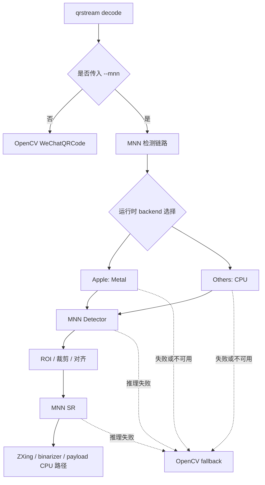

# WeChatQRCode -> MNN PoC

### 目标

在**尽量少引入外部依赖**的前提下，把 `WeChatQRCode` 的两个 Caffe CNN（检测 + 超分）迁移到 `MNN` 推理栈，优先降低单帧检测延迟，并保留当前仓库的解码与 LT 流程。

第一版不追求全平台 GPU 覆盖，而是先把 **Apple `Metal -> CPU`** 路线做透，同时保留 `OpenCV WeChatQRCode` 作为稳定 fallback。

### 当前结论

- 上游 `wechat_qrcode` 源码已拉取到 `dev/wechatqrcode-mnn-poc/third_party/opencv_contrib/modules/wechat_qrcode`
- 这部分上游源码仅作为本地参考与对照，不纳入本仓库版本提交
- 当前工作分支：`feature/wechatqrcode-research`
- 当前仓库已改用 `feature/* -> dev -> main` 的提交流程；本 PoC 后续按 `feature/*` 工作分支推进
- `WeChatQRCode` 的两个 CNN 都是通过 `OpenCV DNN + Caffe` 加载：
  - `src/detector/ssd_detector.cpp` -> `dnn::readNetFromCaffe(...)`
  - `src/scale/super_scale.cpp` -> `dnn::readNetFromCaffe(...)`
- 当前仓库仍直接调用 `cv2.wechat_qrcode_WeChatQRCode()`，没有 backend 选择层，也没有 detector / SR 分阶段调度层
- 第一条 PoC 主线仍是：**直接验证 `Caffe -> MNN`，把推理从 OpenCV DNN 黑盒中拆出来**

### 为什么优先选 MNN

- **支持直接 `Caffe -> MNN`**，不一定必须先转 ONNX
- backend 覆盖面贴近目标需求：`CPU / Metal / CUDA / OpenCL`
- 适合做“小核心 + 按后端裁剪”的轻量分发
- Python 层显式依赖较少，便于与当前 `qrstream` 集成
- 对 Apple 首版非常友好：`Metal` 是系统原生能力，宿主依赖最少

### 产品方向先拍板

这次讨论后，后续方案统一按下面的产品化约束推进：

- **默认安装包**：`qrstream`
  - Apple 平台：默认尝试 `Metal -> CPU`
  - 其他平台：默认 `CPU`
- **额外版本 / extras 语义**：
  - `qrstream[cpu]`：显式 CPU 版，运行时 `CPU`
  - `qrstream[cuda]`：启用 `CUDA -> CPU`
  - `qrstream[opencl]`：启用 `OpenCL -> CPU`
  - `qrstream[all]`：启用所有支持的后端，运行时统一 fallback 到 `CPU`
- **第一版行为**：
  - 保留 `OpenCV WeChatQRCode` 作为 fallback
  - 新增 `--mnn` 参数，显式开启 MNN 加速路径
  - 第一版只实现 `Metal` 版本
  - 非 Apple 平台第一版不做 GPU 加速落地，先走 `CPU / OpenCV fallback`

### 对外安装与运行策略

#### 1. 安装层策略

目标不是让 `pip` 在安装时猜 GPU 厂商，而是：

- 让 `pip` 只负责**按平台挑 wheel**
- 让 `qrstream` 在**运行时选择 backend 并 fallback**

建议对用户暴露为：

```bash
pip install qrstream
pip install 'qrstream[cpu]'
pip install 'qrstream[cuda]'
pip install 'qrstream[opencl]'
pip install 'qrstream[all]'
```

实现上建议：

- 默认 `qrstream` 发布为**平台感知 wheel**
  - macOS wheel：编入 `Metal`
  - 非 macOS wheel：默认只保留 `CPU`
- `cuda/opencl/all` 对外暴露为 extras 语义
- extras 的内部落地可选：
  - 后端子包
  - 平台专属 wheel
  - 单独 backend runtime 包

也就是说，**对用户是 extras 语义，对维护侧不强制必须是单一 wheel**。

#### 2. 运行时策略

第一版约束如下：

- 默认不启用 MNN，仍走当前 `OpenCV WeChatQRCode`
- 用户显式加 `--mnn` 时才进入新路径
- 第一版 backend 选择规则：
  - Apple：`Metal -> CPU -> OpenCV fallback`
  - 其他平台：`CPU -> OpenCV fallback`
- 后续版本扩展为：
  - `CUDA -> CPU -> OpenCV fallback`
  - `OpenCL -> CPU -> OpenCV fallback`
  - `All(auto) -> 最优可用 backend -> CPU -> OpenCV fallback`

### 第一版推荐接口

#### CLI

第一版先保持接口最小增量：

```bash
qrstream decode input.mp4 -o output.bin
qrstream decode input.mp4 -o output.bin --mnn
```

建议解释为：

- 不带 `--mnn`：沿用现有 `OpenCV WeChatQRCode`
- 带 `--mnn`：尝试启用 MNN 加速链路
- 如果 MNN backend 不可用或推理失败：自动回退到 `OpenCV WeChatQRCode`

#### Python API

建议新增一个显式开关，而不是立即重写所有默认路径：

- `use_mnn: bool = False`
- 后续再扩展可选 backend 枚举，例如：`auto/cpu/metal/cuda/opencl`

第一版不建议暴露太多 backend 参数，先把 `--mnn` 的正确性和 fallback 逻辑跑稳。

### 首版架构图



### 分阶段实施边界

#### Milestone 0：研究与模型验证

目标：证明两个模型**能转**、**能跑**、**输出结构基本对齐**。

- 提取并归档模型文件来源与哈希
- 使用 `MNNConvert` 尝试：
  - `detect.caffemodel + detect.prototxt -> detect.mnn`
  - `sr.caffemodel + sr.prototxt -> sr.mnn`
- 用少量静态图片验证：
  - detector 是否输出合理 bbox
  - SR 是否输出正确尺寸与像素范围
- 暂不接业务主链，只做离线比对

#### Milestone 1：Apple Metal 首版接入

目标：在 **Apple 平台** 打通 `Metal -> CPU -> OpenCV fallback`，并提供 `--mnn` 显式开关。

- 新建 `MNN Detector Runner`
- 新建 `MNN SR Runner`
- 新建 MNN 可用性检测与 backend 选择层
- 在 `decode` 路径增加 `--mnn`
- 新增可替换的 `QRDetector` 适配层，避免把 MNN 路径继续写死在 `try_decode_qr()` 里
- 与 `origin/fix/wechat-native-crash` 的兼容基线保持一致：
  - 如目标基线已包含 `--detect-isolation`，则 `--mnn` 必须与其共存
  - 保留 `_dispatch_detect` / `DETECTOR_CAN_CRASH` 这一类检测分发抽象的兼容接入点
  - 不破坏 `OpenCV WeChatQRCode` 作为稳定 fallback 的默认行为
- 保留现有：
  - OpenCV 图像读取
  - ROI 裁剪 / 对齐
  - ZXing 解码
  - `qrstream` payload / LT 解码
- 当 MNN backend 初始化失败、推理失败、结果异常时，自动回退到 `OpenCV WeChatQRCode`

这是第一版的明确交付边界。

#### Milestone 2：CPU 正式版与打包落地

目标：把默认包策略与显式 `cpu` 版本整理清楚，形成稳定分发模型。

- `qrstream` 默认包：
  - Apple 上默认支持 `Metal -> CPU`
  - 其他平台默认 `CPU`
- 明确 `qrstream[cpu]` 对外语义
- 明确模型文件、wheel、backend runtime 的分发方式
- 补充安装失败、backend 不可用、fallback 发生时的日志提示
- 建立针对单帧延迟的基准测试流程

#### Milestone 3：CUDA / OpenCL 扩展

目标：补齐 GPU 变体，但不改变统一 fallback 规则。

- `qrstream[cuda]`：`CUDA -> CPU -> OpenCV fallback`
- `qrstream[opencl]`：`OpenCL -> CPU -> OpenCV fallback`
- 补充不同平台 / 驱动环境下的安装与诊断说明
- 补充 backend 探测日志、禁用开关与降级策略

#### Milestone 4：`qrstream[all]` 与统一 auto 策略

目标：提供全量后端版，但仍把运行时行为保持可解释。

- `qrstream[all]`：启用所有支持的 backend
- 统一 runtime 选择逻辑：
  - Apple 优先 `Metal`
  - NVIDIA 优先 `CUDA`
  - 其他支持 OpenCL 的平台优先 `OpenCL`
  - 最终统一回退 `CPU`
- 明确日志输出“当前选中的 backend”和“回退原因”

#### Milestone 5：流水线优化

目标：在不牺牲稳定性的前提下，再追求吞吐和资源利用率。

- 将 detector / SR / decode 分阶段
- 评估 ROI 复用、条件性触发 SR、帧级缓存
- 评估 CPU / GPU overlap
- 评估多线程队列与异步流水线

注意：这一阶段主要偏向**视频流吞吐**，不是第一版的首要目标。

### TODO 清单（按迭代版本）

#### V0 - 研究版

- 确认 `detect` / `sr` 模型来源、许可证与哈希
- 验证两个 Caffe 模型能否稳定转成 `.mnn`
- 建立 OpenCV DNN 与 MNN 的输出比对脚本
- 记录 Apple 测试机型、系统版本、Python 版本

#### V1 - Metal 首版

- 增加 `--mnn` CLI 开关
- 接入 `Metal -> CPU -> OpenCV fallback`
- 实现 detector / SR 的最小 MNN runner
- 引入可替换 `QRDetector` 适配层，避免继续把实现绑死在 `cv2.wechat_qrcode_WeChatQRCode()`
- 兼容 `fix/wechat-native-crash` 的检测隔离接口与回归约束
- 为 malformed frame / 空 ROI / 越界 bbox / 异常 tensor shape 增加回归测试
- 建立单帧延迟 benchmark
- 建立 fallback 命中日志与诊断信息

#### V2 - CPU 分发版

- 明确 `qrstream` 默认包与 `qrstream[cpu]` 语义
- 整理模型文件与 wheel 打包布局
- 完善 MNN 不可用时的错误信息
- 补充文档：安装、验证、诊断

#### V3 - CUDA / OpenCL 扩展版

- 增加 `qrstream[cuda]`
- 增加 `qrstream[opencl]`
- 补充驱动环境检查与报错说明
- 扩展 benchmark 到跨平台对比

#### V4 - All 统一版

- 增加 `qrstream[all]`
- 增加统一 auto backend 选择器
- 增加 backend 选择与 fallback 日志
- 增加禁用指定 backend 的调试能力

#### V5 - 流水线优化版

- 引入 detector / SR / decode 分阶段队列
- 增加条件性 SR 策略
- 引入帧间缓存或 ROI 复用
- 分别评估单帧延迟与视频吞吐收益

### 接下来的实现顺序（按当前计划）

#### Step 0：先对齐即将进入 `dev` 的兼容基线

后续实现不能只看当前工作树，还要把 `origin/fix/wechat-native-crash` 视为**必须兼容的近未来基线**。也就是说，MNN 接入不能假设二维码检测永远是“进程内、同步、不会 native crash”的。

当前建议的兼容基线是：

- 如果目标集成基线已经包含 `--detect-isolation`：
  - `--mnn` 必须与其共存，不能互相覆盖
  - `extract_qr_from_video(..., detect_isolation=...)` 的语义不能被破坏
- 如果目标集成基线已经包含 `_dispatch_detect`：
  - 新 detector 必须通过统一分发口接入，而不是再把 MNN 路径写死进 worker
- 如果目标集成基线已经包含 `DETECTOR_CAN_CRASH`：
  - 新 detector 是否可绕过 isolation，必须是显式策略，不允许隐式假设

#### Step 1：先抽象 detector，再接 MNN

建议先抽出一个可替换的 `QRDetector` 适配层，再去接 `MNN Detector Runner` / `MNN SR Runner`。

推荐最小拆分：

- `OpenCVWeChatDetector`：包住当前 `cv2.wechat_qrcode_WeChatQRCode()` 路径
- `MNNQrDetector`：包住 detector + SR + CPU decode 的新链路
- `DetectorRouter`：负责 `--mnn`、backend 选择、fallback 以及将来与 isolation 的衔接

这样做的好处是：

- 不会把 `--mnn` 逻辑散落到 `decoder.py` 多个 worker 里
- 不会把当前 fallback 路径重写成不可回退的 hard switch
- 后面兼容 sandbox 或其他 detector 时，不需要再次大改 worker 签名

#### Step 2：实现最小可用 `MNNQrDetector`

第一版建议严格收敛到：

- 输入：单帧 `np.ndarray`
- 输出：`str | None`
- 内部流程：
  - frame 预处理
  - detector `.mnn` 推理
  - bbox / ROI 还原
  - 必要时 SR `.mnn` 推理
  - CPU decode
- 不做项：
  - 不在 V1 引入多阶段异步流水线
  - 不在 V1 引入跨帧缓存
  - 不在 V1 替换现有默认 detector 路径

#### Step 3：把 `--mnn` 接到 decode 主链，但不破坏当前行为

接入顺序建议是：

1. 默认仍走 `OpenCV WeChatQRCode`
2. 显式传入 `--mnn` 才启用新 detector
3. MNN 初始化失败 / backend 不可用 / 输出异常时，自动回退到 OpenCV fallback
4. 如果未来合入了 `--detect-isolation`，则还要保证：
   - crashable detector 走隔离
   - non-crashing detector 可以选择直接进程内执行

#### Step 4：先补正确性与边界测试，再谈 benchmark

V1 必须先覆盖：

- malformed frame
- 非连续内存输入
- 空 ROI / 负宽高 ROI
- bbox 越界 / 部分越界
- tensor shape 不符预期
- detector 输出数量与 tensor 实际长度不匹配
- fallback 命中场景

这些测试稳定后，再用 benchmark 评估单帧延迟收益。

### 必读文档与代码路径

#### 本地必读

开始实现前，至少完整阅读以下文件：

- `dev/wechatqrcode-mnn-poc/README.md`
- `src/qrstream/qr_utils.py`
- `src/qrstream/decoder.py`
- `src/qrstream/cli.py`
- `pyproject.toml`
- `dev/wechatqrcode-mnn-poc/third_party/opencv_contrib/modules/wechat_qrcode/src/detector/ssd_detector.cpp`
- `dev/wechatqrcode-mnn-poc/third_party/opencv_contrib/modules/wechat_qrcode/src/scale/super_scale.cpp`

#### remote 必读（`origin/fix/wechat-native-crash`）

这些内容虽然还不在当前工作树里，但已经构成后续集成必须兼容的重要约束。阅读时可直接用 `git show origin/fix/wechat-native-crash:<path>`。

- `origin/fix/wechat-native-crash:dev/INCIDENT-wechat-native-crash.md`
- `origin/fix/wechat-native-crash:dev/HANDOFF-sandbox-implementation.md`
- `origin/fix/wechat-native-crash:src/qrstream/qr_sandbox.py`
- `origin/fix/wechat-native-crash:src/qrstream/decoder.py`
- `origin/fix/wechat-native-crash:src/qrstream/cli.py`
- `origin/fix/wechat-native-crash:src/qrstream/qr_utils.py`
- `origin/fix/wechat-native-crash:tests/test_qr_sandbox.py`
- `origin/fix/wechat-native-crash:tests/test_decoder_sandbox_integration.py`

#### 实现时必须重点参考的兼容点

来自 remote 分支、后续不应破坏的行为包括：

- `extract_qr_from_video(..., detect_isolation='on'|'off')` 的参数语义
- `_dispatch_detect` 在 decode 前后必须恢复原值
- `detect_isolation='on'` 与 `'off'` 最终都应能重建相同 payload
- sandbox 初始化失败时不能把 decode 整体搞挂
- 当前 `OpenCV WeChatQRCode` fallback 行为必须继续成立

### 来自 `fix/wechat-native-crash` 的故障与新增设计约束

#### 已确认的故障事实

远端事故文档确认的根因不是 Python 层异常，而是 `opencv_contrib` 自带 `zxing` 在 `detectAndDecode()` 内部出现**内容相关的 native 越界访问**：

- 低质量 / 噪声帧被误判为 Finder Pattern
- `calculateModuleSizeOneWay(...)` 沿像素射线向外走时坐标越过位图边界
- `BitMatrix::get(int, int)` 未做边界检查，发生 wild memory access
- 结果是**有时只是 no-detect，有时直接 `SIGSEGV` / `SIGTRAP` 杀进程**
- 该问题受 ASLR、线程调度、堆布局影响，**同一文件同一机器也可能一轮 crash、一轮成功**

这意味着：**后续替代 `WeChatQRCode` 的新 `qrdetector` 绝不能只追求识别率，还必须把边界安全作为一等约束。**

#### 新 `qrdetector` 的强制安全要求

为了避免出现与远端分支记录的同类越界读写问题，新的 `MNNQrDetector` / `QRDetector` 必须满足：

1. **所有输入帧先做形状校验**
   - 只接受预期的 `dtype`、`ndim`、channel 数
   - 空数组、零高宽、异常 stride 输入直接返回 `None` 或走 fallback
   - 非连续内存如有需要先显式复制，不允许假设底层 buffer 连续

2. **所有 bbox / ROI 必须在图像边界内裁剪后再访问**
   - 不允许直接信任模型输出的坐标
   - 负坐标、反向坐标、超出边界坐标都必须在 crop 前被夹紧或判无效
   - `warp` / `resize` / `SR` 入口不接受空 ROI

3. **所有 tensor 解析必须以实际 shape / length 为准**
   - 不允许只相信模型输出里的 `count` 字段
   - 任何 `num_boxes`、`num_scores`、landmark 数量都必须与 tensor 实际长度交叉校验
   - 一旦长度不匹配，按 no-detect / fallback 处理，而不是继续读下一个元素

4. **后处理不能出现未检查的偏移计算**
   - 不允许手写“指针 + 偏移”式访问逻辑
   - 优先使用 Python / NumPy 的边界安全切片
   - 如果未来不得不下沉到 C/C++ / Cython / Rust 原生扩展，必须显式做边界检查与溢出检查
   - 一旦引入任何原生扩展或 native 后处理，构建与测试必须按用户约定统一走 `podman`，并补充 ASan / UBSan 或等价边界检查流程

5. **在证明新 detector 完全稳定前，不得假设其永不崩溃**
   - 设计上至少要保留与 `DETECTOR_CAN_CRASH` / `--detect-isolation` 兼容的接入面
   - 只有在验证充分后，才允许将新 detector 视为 non-crashing 并绕过隔离

6. **任何异常输出都必须优先降级为 no-detect 或 fallback**
   - 不能因为单帧异常把整轮 decode 搞挂
   - 不能因为某个 ROI 非法就中断整个 worker / 整个视频解码流程

#### 对当前实现的兼容要求

MNN 接入不是重写一套新解码器，而是**兼容当前实现并逐步替换 detector**。因此必须保证：

- 当前 `OpenCV WeChatQRCode` 路径仍可作为回退兜底
- 当前 `decoder.py` 的 worker / probe / main scan / targeted recovery 流程不被破坏
- 当前 CLI 使用方式不因 `--mnn` 接入而改变默认行为
- 如果将来 rebase / merge 进带有 sandbox 的 `dev`，MNN 方案仍能挂到统一 detect dispatch 上

### 为什么第一版优先追单帧延迟

这里先把“单帧延迟”和“视频流吞吐”区分清楚：

#### 单帧延迟

指一帧图像从“送入检测”到“拿到解码结果”的耗时。

更适合以下场景：

- 用户拿手机对准屏幕，希望**尽快扫出来**
- 单次扫码成功时间要更短
- 交互感知更强

这次第一版更应该优先关注它，因为：

- `--mnn` 首版是局部加速，不是整条链重构
- 首版先验证新链路是否值得接入主线
- Apple `Metal` 的价值也更容易先在单帧 latency 上体现

#### 视频流吞吐

指单位时间内能处理多少帧，例如 FPS 或每秒可处理帧数。

更适合以下场景：

- 长视频离线解码
- 高帧率采集流
- 后台批量处理

它通常需要：

- detector / SR / decode 分阶段
- 多线程或异步队列
- CPU / GPU 重叠执行

所以吞吐优化更适合放到 `Milestone 5`。

#### 二者的核心区别

- **追单帧延迟**：关心“第一帧、当前帧，多久出结果”
- **追视频流吞吐**：关心“长期跑起来，每秒能处理多少帧”

很多情况下：

- 单帧延迟变好，不代表吞吐一定同比例变好
- 吞吐变好，也不代表用户感觉首帧更快

对当前 `qrstream` 的第一版 MNN 接入来说，建议优先级是：

1. **识别正确性不掉**
2. **单帧延迟下降**
3. **fallback 稳定**
4. 再考虑吞吐优化

### 预期性能判断（按当前目标重估）

以第一版 `Metal` 路线为主，目标应当更保守、更聚焦：

- **只迁 detector + SR，不改主解码链**：
  - 单帧端到端延迟，现实预期约 **`1.3x ~ 2.2x`**
- **难样本且经常触发 SR**：
  - 可能更接近 **`1.8x ~ 2.5x`**
- **如果未来再做流水线并行**：
  - 吞吐提升空间通常比单帧延迟更大

因此第一版 KPI 建议优先定义为：

- P50 单帧延迟下降
- P95 单帧延迟不劣化过多
- 识别率与 OpenCV 基线保持一致或接近
- fallback 命中后功能不退化

### 关键风险

#### 1. Caffe SSD 头兼容性

检测模型可能涉及这些风险层：

- `PriorBox`
- `DetectionOutput`
- `Permute`
- `Flatten`

如果 `MNN` 对 `DetectionOutput` 支持不理想，备选方案是：

- 网络只输出 raw tensor
- 在宿主代码中自己实现 decode / NMS / bbox 还原

#### 2. SR 输出一致性

超分模型即使能成功运行，也仍需验证：

- 输出尺寸是否一致
- 像素范围 / 归一化方式是否一致
- 与原 OpenCV DNN 版本相比是否存在锐化、对比度偏移

#### 3. Metal 首版的真实收益可能被非 CNN 阶段吞掉

即使 detector / SR 提速明显，整条链仍有 CPU 开销：

- 裁剪 / 透视 / 对齐
- 二值化尝试
- ZXing 解码
- `qrstream` payload / LT 恢复

因此第一版必须同时看：

- detector / SR 纯推理耗时
- 端到端单帧延迟
- 真实样本识别率
- fallback 触发比例

#### 4. 打包语义与实现形态可能不完全一一对应

对外我们可以定义：

- `qrstream`
- `qrstream[cpu]`
- `qrstream[cuda]`
- `qrstream[opencl]`
- `qrstream[all]`

但内部不一定必须做成单一 wheel；更现实的方式可能是：

- 平台 wheel + extras
- backend 子包
- 条件依赖 + runtime 探测

这部分在 `Milestone 2` 再最终拍板即可，第一版先不被打包细节卡死。

### 建议的目录与产物

建议后续 PoC 产物放在：

- `dev/wechatqrcode-mnn-poc/README.md`：方案、结论、里程碑
- `dev/wechatqrcode-mnn-poc/models/`：模型说明、哈希、来源记录
- `dev/wechatqrcode-mnn-poc/scripts/`：转换 / 校验 / benchmark 脚本
- `dev/wechatqrcode-mnn-poc/results/`：平台测试结果与对比表

### 当前仓库集成现状

- 本项目当前依赖的是 `opencv-contrib-python`
- 现有二维码检测入口在 `src/qrstream/qr_utils.py`
- 当前实现直接使用 `cv2.wechat_qrcode_WeChatQRCode()`
- 这意味着未来真正接入 MNN 时，更可能是：
  - 新增一个独立 detector / SR 适配层
  - 在 `decode` 流程中以显式开关接入
  - 暂不替换默认稳定路径

### 下次继续前应记住的信息

- 分支：`feature/wechatqrcode-research`
- 上游源码位置：`dev/wechatqrcode-mnn-poc/third_party/opencv_contrib/modules/wechat_qrcode`
- 用户要求：**构建和测试统一使用 podman**
- 当前推荐方向：**MNN 作为 WeChat CNN 迁移的第一 PoC 方案**
- 当前策略：**优先迁移 detector + super-resolution；ZXing 解码暂留 CPU**
- 产品化策略：
  - `qrstream` 默认 CPU；Apple 默认 `Metal -> CPU`
  - 提供 `qrstream[cuda]`、`qrstream[opencl]`、`qrstream[cpu]`、`qrstream[all]`
  - 所有版本最终都要 fallback 到 `CPU`
- 首版策略：
  - 保留 OpenCV fallback
  - 提供 `--mnn` 显式开关
  - 首版只做 Apple `Metal`
- 当前性能优先级：**先追单帧延迟，再做视频流吞吐优化**
